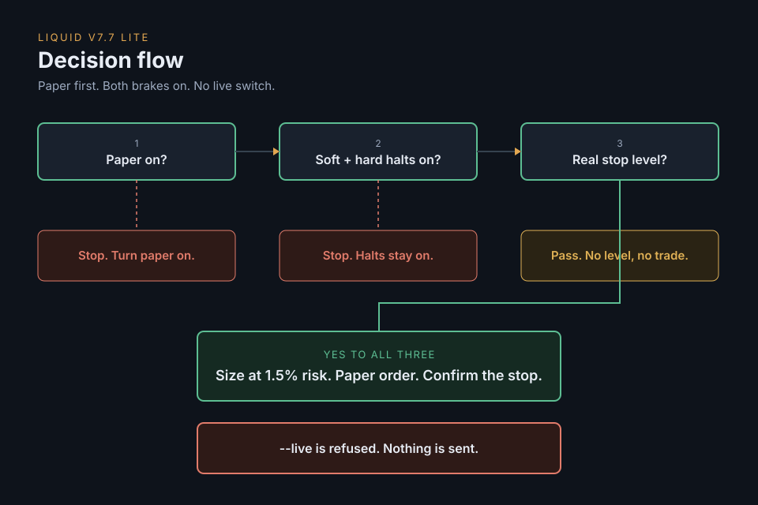

# Agentic Trading for Dummies

This tutorial runs a trading agent on **paper**. Paper means simulated, not real money.

You paste a rulebook (the written rules). A runner (a small Python program) hands that rulebook to a model. The model looks, sizes, and places paper orders.

This repo cannot turn real trading on. `python runner.py --live` is refused.

| Word | Meaning |
|---|---|
| Paper | Simulated. Not real money. |
| Equity | Account value. |
| Stop | The price that exits a bad trade. |
| Halt | A brake that shrinks or blocks new trades after a drop. |
| riskFrac | The slice of equity one trade may lose if the stop is hit. |

## START HERE

Do these steps in order. One path. When a command is different on Windows, it is labeled. Every other command is the same.

Stay inside the `runner` folder from step 1 until the end.

### 1. Check Python, then download

You need Python 3.10 or newer.

Mac or Linux:

```bash
python3 --version
```

Windows PowerShell:

```powershell
py --version
```

You want `Python 3.10` or a higher 3.x. If the command is not found, install Python from <https://www.python.org/downloads/> and run the check again.

Then download this tutorial and open the `runner` folder. That folder contains `runner.py`.

```bash
git clone https://github.com/merjua14/Agentic-Trading-For-Dummies
cd Agentic-Trading-For-Dummies/runner
```

### 2. Make a private Python folder and turn it on

A venv is a private folder of tools for this project. After this step, your prompt starts with `(.venv)`.

Mac or Linux:

```bash
python3 -m venv .venv
source .venv/bin/activate
```

Windows PowerShell:

```powershell
py -m venv .venv
.venv\Scripts\Activate.ps1
```

If Windows says running scripts is disabled, run this once, then the activate line again:

```powershell
Set-ExecutionPolicy -Scope Process -ExecutionPolicy Bypass
```

If Mac or Linux says `ensurepip is not available`, install the venv package and run the two lines again. On Ubuntu that install is `sudo apt install python3-venv`.

### 3. Install the libraries

```bash
pip install -r requirements.txt
```

Success: the command finishes, and you get your prompt back. If it says `No such file`, you are in the wrong folder. See [If something breaks](#if-something-breaks).

### 4. Create `.env` and fill three lines

`.env` is your private settings file. It stays on your computer.

Mac or Linux:

```bash
cp .env.example .env
```

Windows PowerShell:

```powershell
copy .env.example .env
```

Open `.env` in the `runner` folder with any text editor. Fill these three lines. Leave every other line as it is.

```
ANTHROPIC_API_KEY=paste-your-key-here
LIQUID_MCP_URL=paste-the-liquid-url
LIQUID_MCP_TOKEN=paste-the-liquid-token
```

An API key is the password for the model. This file is already set to Anthropic. Create a key at <https://console.anthropic.com/> and paste it after `ANTHROPIC_API_KEY=`.

Liquid is the exchange app this tutorial uses. A connector is the link that lets the program talk to Liquid. Copy the connector URL and token from Liquid into the two `LIQUID_` lines. Turn paper on before step 7. Notes: [setup/00-connectors.md](setup/00-connectors.md).

Already have an OpenAI or xAI key? One key is enough. Set `PROVIDER=openai` or `PROVIDER=xai`, paste that key on its own line, and set `MODEL` to the matching name in the comment. Leave the other key lines empty.

Save the file. No quotes. No spaces around `=`.

### 5. Check the dials

This does not call a model, and it does not send an order.

```bash
python runner.py --check
```

Success looks like this. Then the program stops:

```
mode=paper
riskFrac=0.015
softHalt=on
hardHalt=on
liveFlag=refused
rulebook=ok
```

That is paper on, risk at 1.5% (`0.015`), and both halts on.

### 6. Prove live mode is refused

```bash
python runner.py --live
```

Success is the word `REFUSED`, then the program stops. Nothing is sent to a model or an exchange.

If you see anything else, stop. Do not continue.

### 7. Run once on paper

```bash
python runner.py
```

Success looks like a line that contains `PAPER ONLY`, then a block titled `PAPER REPORT`.

The first run asks the model twice. It can take a few minutes. You do not need to type while you wait.

Read the report with the checks in [After the first paper run](#after-the-first-paper-run).

## If something breaks

### Missing key

You see `Missing key:` and a name such as `ANTHROPIC_API_KEY`, `LIQUID_MCP_URL`, or `LIQUID_MCP_TOKEN`.

You are in the `runner` folder. Open `.env`. Paste a value after each name it listed. Save. No quotes. No spaces around `=`. Run `python runner.py` again.

`PROVIDER=anthropic` uses `ANTHROPIC_API_KEY`. `openai` uses `OPENAI_API_KEY`. `xai` uses `XAI_API_KEY`.

### Paper off

The report says paper is off, or it placed nothing and told you to turn paper on.

In Liquid, turn paper on, then check it. Use `enable_paper_trading`, then `paper_trading_status`. You want paper on. Run `python runner.py` again.

Leave paper on. This tutorial has no live mode.

### Wrong directory

You see `can't open file 'runner.py'`, `No such file or directory`, or `wrong directory`.

The command ran outside the `runner` folder.

```bash
cd Agentic-Trading-For-Dummies/runner
python runner.py --check
```

You should see `mode=paper`. Continue from the step you were on.

## Defaults that ship in this repo

`python runner.py --check` prints these. Leave them alone until you have read [the rulebook](rulebook/liquid-v77-lite.txt) and [the disclaimer](DISCLAIMER.md).

| Knob | Setting |
|---|---|
| Paper | **ON** |
| riskFrac | **1.5%** (`0.015`) |
| Soft halt | **ON** (20% below the equity peak, new trades shrink to a quarter) |
| Hard halt | **ON** (35% below the equity peak, no new trades) |
| Leverage ceiling | **2** |
| `--live` | **Refused** |

## What each file is

```
README.md                      you are here
POST.md                        one X post, ready to paste
THREAD.md                      optional longer thread
DISCLAIMER.md                  read before you run anything
rulebook/liquid-v77-lite.txt   the instructions the model follows
runner/runner.py               the clock. It refuses --live
setup/                         connectors and Claude, ChatGPT, Grok, or the runner
docs/index.html                the same defaults, as a one-page configurator
assets/decision-flow.svg       the picture of the decision
assets/og.png                  share image
```

## The picture



## After the first paper run

In the report, you want three things:

- It says paper mode is on.
- When it skips a trade, it names the one reason.
- Any paper position it opens has a stop, and it checked that the stop is actually there.

Scheduling a repeat is optional. The steps are in [setup/api-runner.md](setup/api-runner.md). The runner still refuses `--live`.

This tutorial still has no live switch. A real-money bot is a different project. It is not this repo.

## More, still plain

- [Connectors](setup/00-connectors.md)
- [Which app can schedule it](setup/PLATFORM-MATRIX.md)
- [The runner, step by step](setup/api-runner.md)
- [Claude](setup/claude.md) · [ChatGPT](setup/chatgpt.md) · [Grok](setup/grok.md)
- [Disclaimer](DISCLAIMER.md)
- [One-page configurator](docs/index.html)

The configurator link opens the file. A published page needs GitHub Settings, then Pages, then branch `main` and folder `/docs`.

Share link: https://github.com/merjua14/Agentic-Trading-For-Dummies

MIT license. Built by [@ITSJCMERLO](https://x.com/ITSJCMERLO).
